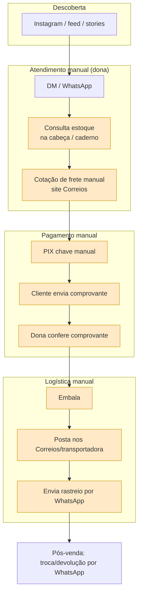
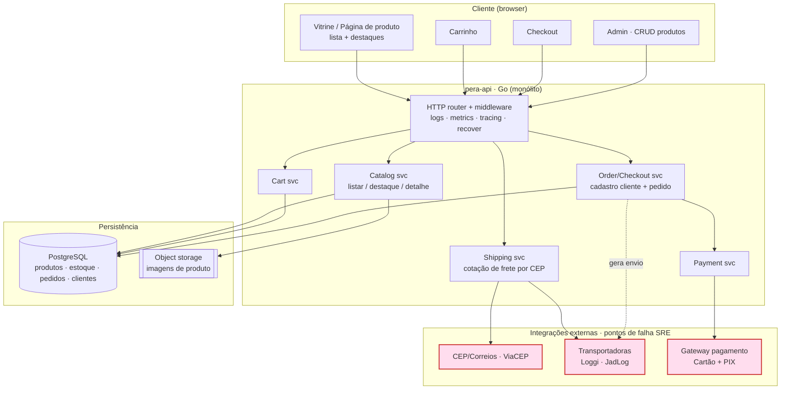

# 🗺️ Discovery — jornada de venda e operação

> Task: [Discovery: mapear a jornada atual de venda e operação](https://app.notion.com/p/3bcb921d081181fa88b5cdbfccc59685)
> Referência: ADR-001 — produto-escola com migração progressiva.

Dois mapas: o **as-is** (operação manual de hoje) e o **to-be** (arquitetura técnica alvo da `pera-api`). A migração é progressiva: cada fase substitui um pedaço do manual.

---

## 1. As-is — jornada manual atual

> ⚠️ **A validar com quem opera a loja.** Montado por inferência (loja de crochê artesanal); confirmar cada passo antes de tratar como verdade.

**Rotinas manuais / dores (evidência da task):**
- Estoque não persistido → risco de vender peça única duas vezes.
- Conciliação de pagamento manual (olhar comprovante).
- Sem catálogo → toda dúvida de preço/disponibilidade vira conversa.
- Sem histórico de pedido → pós-venda depende da memória do chat.

---

## 2. To-be — arquitetura técnica alvo

### Integrações e dados trocados

| Integração | Direção | Dados trocados | Falha impacta |
|---|---|---|---|
| ViaCEP/Correios | out | CEP → endereço/UF | cotação de frete |
| Loggi / JadLog | out (+webhook) | origem, destino, peso/dim → prazo+preço; etiqueta/rastreio | checkout e pós-venda |
| Gateway (Cartão/PIX) | out (+webhook) | valor, cartão/PIX → status, `payment_id` | conclusão do pedido |
| Object storage | out | imagens de produto | vitrine |

### Exceções (fora do happy path)
- **Estoque**: peça normalmente unidade única → reserva no carrinho/checkout p/ evitar venda dupla.
- **Cancelamento**: pago e não enviado → estorno no gateway.
- **Devolução**: pós-entrega → logística reversa + reembolso.
- **Atendimento**: hoje manual (WhatsApp) — candidato a integrar depois.

### Notas SRE / segurança
- Caixas vermelhas = falhas externas → timeout, retry c/ backoff, circuit breaker, **idempotência no webhook de pagamento**.
- Chaves do gateway em secret manager, nunca no código.
- Não trafegar dados de cartão pelo backend (tokenização no gateway) → fora de escopo PCI.
