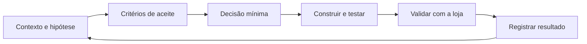

# Loops de produto e engenharia

Um loop é a menor fatia vertical que produz valor observável e reduz uma incerteza importante. Não é uma tarefa técnica isolada, nem um período fixo.

## Ciclo

## Regras operacionais

- Um loop tem uma hipótese, uma fatia de usuário e um resultado verificável.
- Não iniciar implementação se houver decisão pendente que mude o comportamento essencial.
- Manter o loop pequeno o suficiente para ser validado em dias, não em semanas.
- Testes automatizados comprovam regras; validação com a loja comprova utilidade.
- Ao fechar, registrar o resultado mesmo quando a hipótese falhar. Isso é aprendizado, não desperdício.

## Onde cada coisa vive

| Informação | Local |
| --- | --- |
| visão e escopo | `docs/product/visao-produto.md` |
| regras confirmadas/hipóteses | `docs/product/regras-de-dominio.md` |
| decisões transversais | `docs/architecture/decisoes.md` |
| estado de cada loop | `docs/loops/NNN-nome.md` |
| fila e loop atual | `docs/loops/indice.md` |

